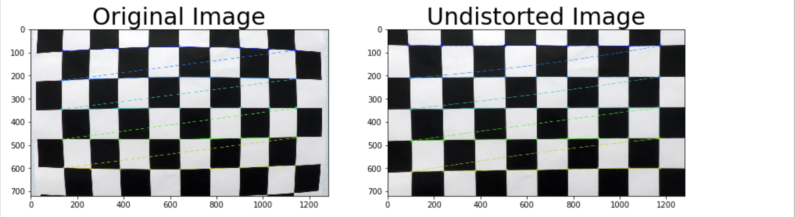
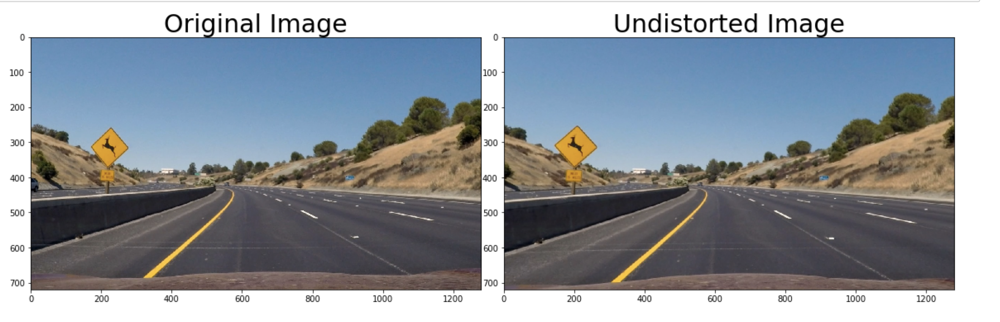
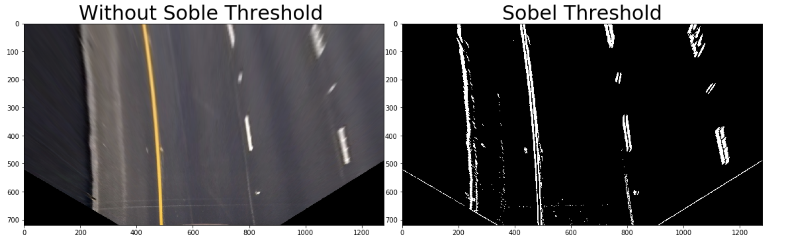
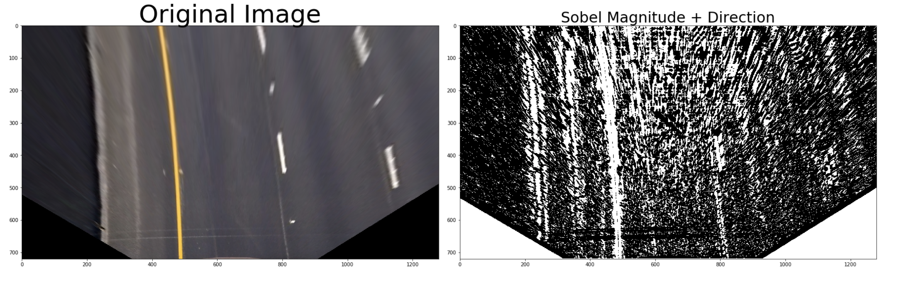
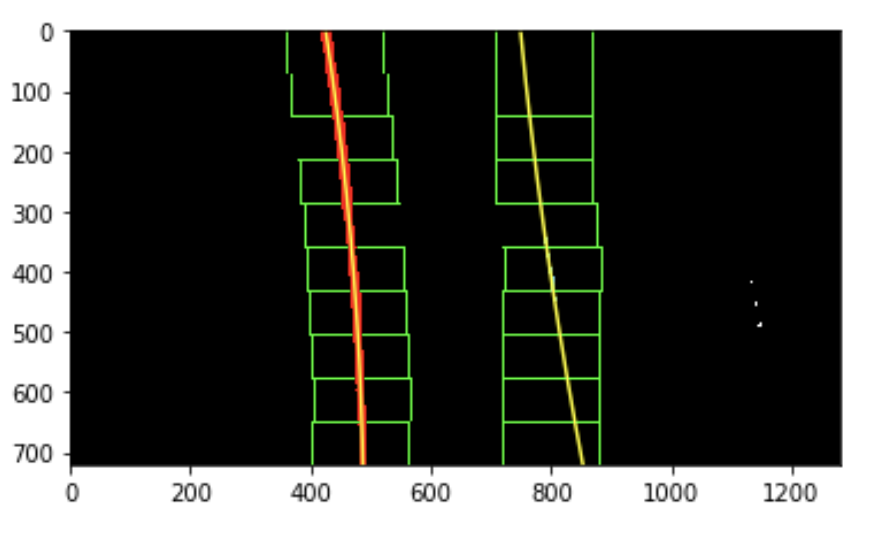
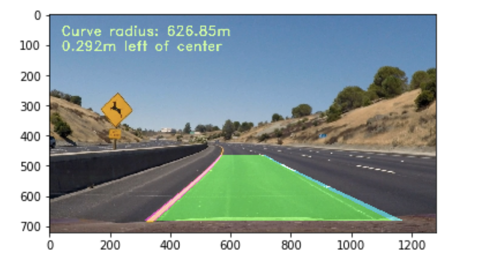

# self Driving car Advanced Lane line 

#### The aim of the project 
     * Using computer vision for various taskes 
        1 Measuring distortion
        2 Calibrating Camera
        3 Correction for distortion
        5 Use color transforms
        6 Apply a perspective transform to rectify binary image ("birds-eye view")
        7 Detect lane pixels and fit to find the lane boundary
        8 Determine the curvature of the lane
        9 Warp the detected lane boundaries back onto the original image
        10 O/P the lane image with estimates of curved and boundary defined for accurate path for car to stay on the
        path 
    
    
-----    
            
#### Rubric Point
    * Here I will consider the rubric points individually and describe how I addressed each point in my 
      implementation.
      
##### File Submission and Code qualiy
    
    File submission inculde all the required files that are necessary to quialy the project submission
    
       1) project.ipynb
       2) Readme.md
       3) Writeup.up
    
#### Below are the steps described individually that are implement in the project 
        
        1) Finding corners
        
        2) Camera calibration

        4) Perspective Transform to bird's eye view
        
        5) Binary lane line image using gradient and color transforms
        
        6) Sobel Utilisation
        
        6) Identifying lane line pixels using sliding windows

        7) Extracting the local curvature of the road and vehicle localization

        8) Projecting the detected lane lines onto the original image
        
        9) Video Processing Pipeline

###### 1) Finding corners

Corders of the chess board are spoted so that the further calibration can be done.

##### 2) Camera calibration

Image distortion occurs when a camera looks at 3D objects in the real world and transforms them into a 2D image; this transformation isn’t perfect. Distortion actually changes what the shape and size of these 3D objects appear to be. So, the first step in analyzing camera images, is to undo this distortion so that you can get correct and useful information out of them.

####  Test Image Pipeline

##### 3)Example of a distortion corrected image
Applying the undistortion transformation to a test image yields the following result (left distorted, right corrected) 

##### 4) Perspective Transform to bird's eye view
A perspective transform to and from "bird's eye" perspective is done in a function called warp(), The warp() function takes as input an color image (img), as well as the tobird boolean paramter. The parameters src and  dst of the transform.

##### 5) Binary lane line image using gradient and color transforms

color traformation was done using RGB , HSV and HLS below is the image porduced after the color transformation

##### 6) Sobel Utilisation

    I used variouts sobel Operators in order to find the image details
    
    1) absolute Sobel threshold

    2. magnitue threshold

    3. direction threshold

#### Identifying lane line pixels using sliding windows

depending upon the threshold the image pixel were recognised and sliding window was implemented in order to get results, The bootom of the image was recognised and pipline filted was run over in order to get the accurate results, further cuvers were recognised on each fram and x along with y value was recognised on which green shade was build over 
    

##### 7) mExtracting the local curvature of the road and vehicle localization

The radius of curvature is computed upon calling the Line.update() method of a line. The method that does the computation is called Line.get_radius_of_curvature(). The mathematics involved is summarized in this tutorial here.
For a second order polynomial f(y)=A y^2 +B y + C the radius of curvature is given by R = [(1+(2 Ay +B)^2 )^3/2]/|2A|.

The distance from the center of the lane is computed in the Line.set_line_base_pos() method, which essentially measures the distance to each lane and computes the position assuming the lane has a given fixed width of 3.7m.

#### Video Processing Pipeline

ALL the gathered knowledge was applied into single piple line and result was achieved 