# self Driving car Advanced Lane line 


#### The aim of the project 
     * Using computer vision for various taskes 
        1 Measuring distortion
        2 Calibrating Camera
        3 Correction for distortion
        5 Use color transforms
        6 Apply a perspective transform to rectify binary image ("birds-eye view")
        7 Detect lane pixels and fit to find the lane boundary
        8 Determine the curvature of the lane
        9 Warp the detected lane boundaries back onto the original image
        10 O/P the lane image with estimates of curved and boundary defined for accurate path for car to stay on the
        path 
    
    
-----    
            
#### Rubric Point
    * Here I will consider the rubric points individually and describe how I addressed each point in my 
      implementation.
      
##### File Submission and Code qualiy
    
    File submission inculde all the required files that are necessary to quialy the project submission
    
       1) project.ipynb
       2) Readme.md
       3) Writeup.up
    
#### Below are the steps described individually that are implement in the project 
        
        1) Finding corners
        
        2) Camera calibration

        4) Perspective Transform to bird's eye view
        
        5) Binary lane line image using gradient and color transforms
        
        6) Sobel Utilisation
        
        6) Identifying lane line pixels using sliding windows

        7) Extracting the local curvature of the road and vehicle localization

        8) Projecting the detected lane lines onto the original image
        
        9) Video Processing Pipeline

###### 1) Finding corners

Corders of the chess board are spoted so that the further calibration can be done.


##### 2) Camera calibration

Image distortion occurs when a camera looks at 3D objects in the real world and transforms them into a 2D image; this transformation isn’t perfect. Distortion actually changes what the shape and size of these 3D objects appear to be. So, the first step in analyzing camera images, is to undo this distortion so that you can get correct and useful information out of them.


####  Test Image Pipeline
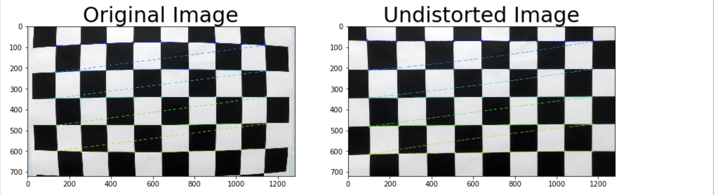

##### 3)Example of a distortion corrected image
Applying the undistortion transformation to a test image yields the following result (left distorted, right corrected) 

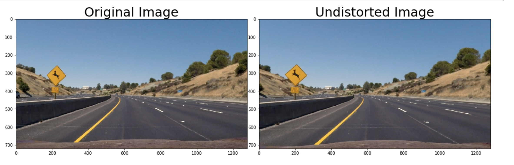

##### 4) Perspective Transform to bird's eye view
A perspective transform to and from "bird's eye" perspective is done in a function called warp(), The warp() function takes as input an color image (img), as well as the tobird boolean paramter. The parameters src and  dst of the transform.

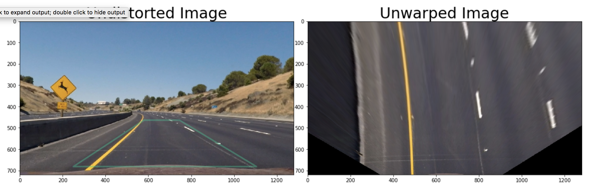

##### 5) Binary lane line image using gradient and color transforms

color traformation was done using RGB , HSV and HLS below is the image porduced after the color transformation

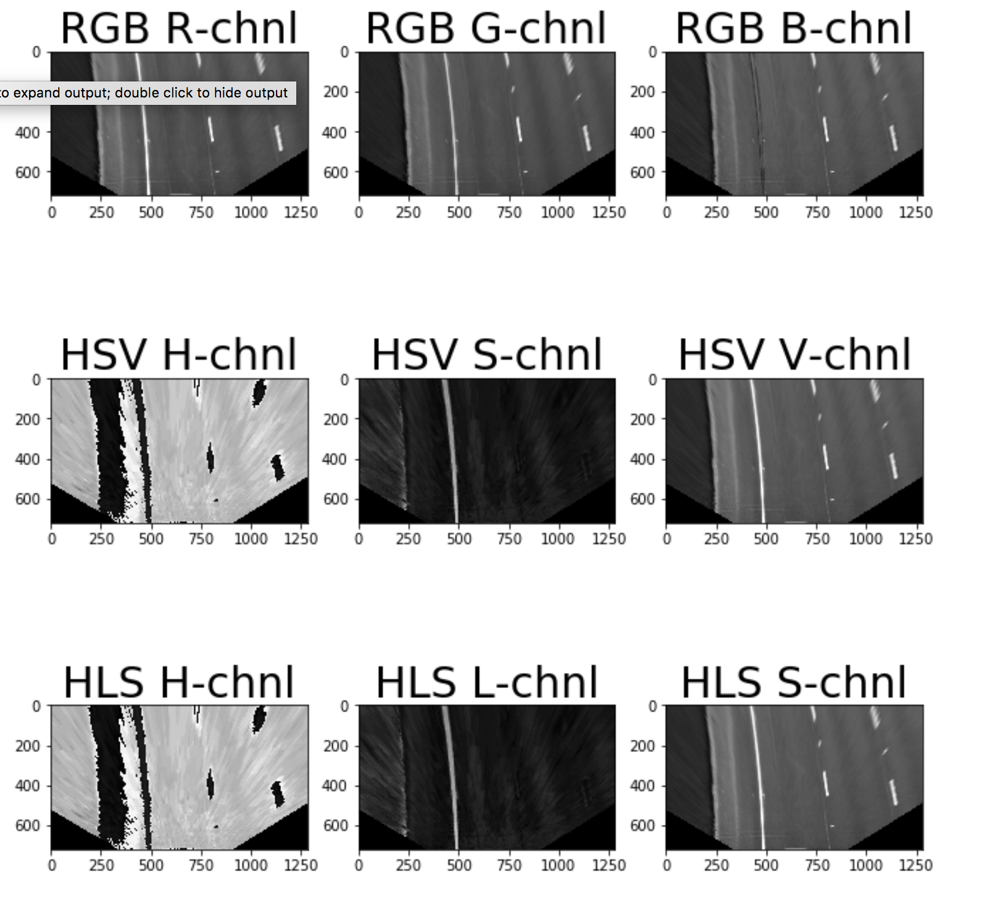

##### 6) Sobel Utilisation

    I used variouts sobel Operators in order to find the image details
    
    1) absolute Sobel threshold
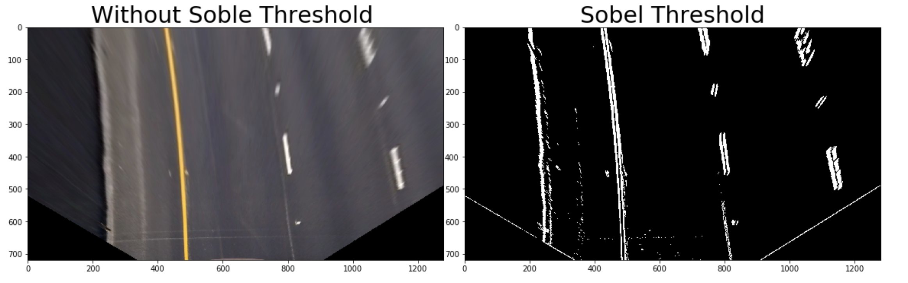
    2. magnitue threshold
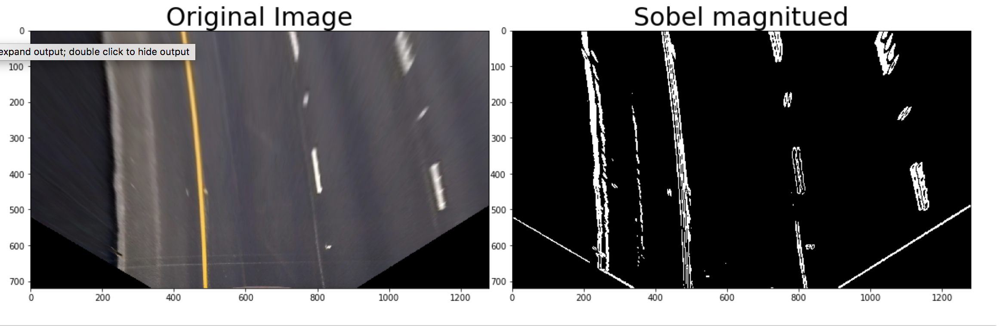
    3. direction threshold
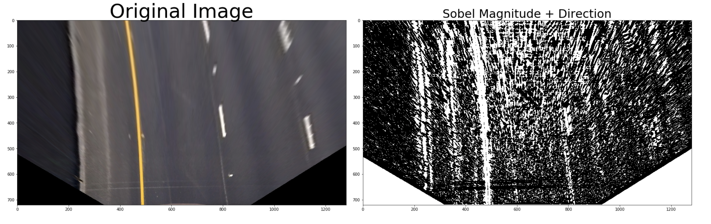


#### Identifying lane line pixels using sliding windows


depending upon the threshold the image pixel were recognised and sliding window was implemented in order to get results, The bootom of the image was recognised and pipline filted was run over in order to get the accurate results, further cuvers were recognised on each fram and x along with y value was recognised on which green shade was build over 
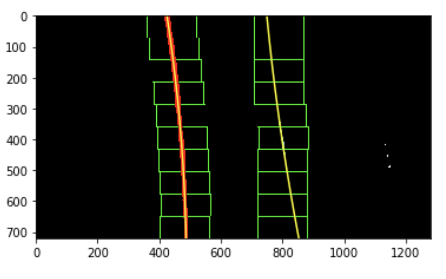  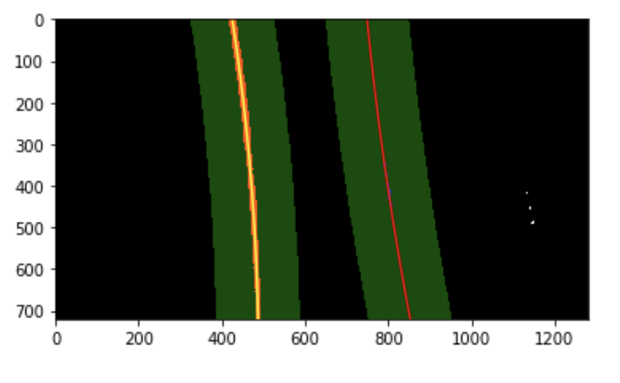  


##### 7) mExtracting the local curvature of the road and vehicle localization

The radius of curvature is computed upon calling the Line.update() method of a line. The method that does the computation is called Line.get_radius_of_curvature(). The mathematics involved is summarized in this tutorial here.
For a second order polynomial f(y)=A y^2 +B y + C the radius of curvature is given by R = [(1+(2 Ay +B)^2 )^3/2]/|2A|.

The distance from the center of the lane is computed in the Line.set_line_base_pos() method, which essentially measures the distance to each lane and computes the position assuming the lane has a given fixed width of 3.7m.
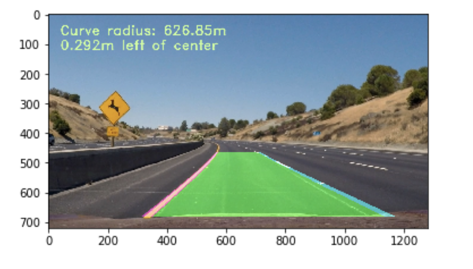

#### Video Processing Pipeline

ALL the gathered knowledge was applied into single piple line and result was achieved 

## Writeup Template

### You can use this file as a template for your writeup if you want to submit it as a markdown file, but feel free to use some other method and submit a pdf if you prefer.

---

**Advanced Lane Finding Project**

The goals / steps of this project are the following:

     * Using computer vision for various taskes 
        1 Measuring distortion
        2 Calibrating Camera
        3 Correction for distortion
        5 Use color transforms
        6 Apply a perspective transform to rectify binary image ("birds-eye view")
        7 Detect lane pixels and fit to find the lane boundary
        8 Determine the curvature of the lane
        9 Warp the detected lane boundaries back onto the original image
        10 O/P the lane image with estimates of curved and boundary defined for accurate path for car to stay on the
        path 

[//]: # (Image References)

[image1]: ./output_images/undistorted.png "Undistorted"
[image2]: ./output_images/undistort_traffic_img.png "Road Transformed"
[image3]: ./output_images/warped_straight_lines.jpg "Warp Example"
[image4]: ./output_images/color_depth.png "Binary Example"
[image5]: ./output_images/finding_lane.png "Fit Visual"
[image6]: ./output_images/embeding_curv.png "Output"
[image7]: ./output_images/unwarped.png "Output"
[image8]: ./output_images/pip_img_1.png "Output"
[image9]: ./output_images/pip_img_2.png "Output"


[video1]: ./project_video.mp4 "Video"

## [Rubric](https://review.udacity.com/#!/rubrics/571/view) Points


### Writeup / README


### Camera Calibration

#### 1. Briefly state how you computed the camera matrix and distortion coefficients. Provide an example of a distortion corrected calibration image.

*Camera Calibration

Image distortion occurs when a camera looks at 3D objects in the real world and transforms them into a 2D image; this transformation isn’t perfect. Distortion actually changes what the shape and size of these 3D objects appear to be. So, the first step in analyzing camera images, is to undo this distortion so that you can get correct and useful information out of them.

this process is done by converting the image into grey image and then finding the corders , dwaing the corners using cv2.drawChessboardCorners()

then i calibrated the image using function cv2.calibrateCamera
![alt text][image1]


### Pipeline (single images)

#### 1. Provide an example of a distortion-corrected image.

To demonstrate this step, I will describe how I apply the distortion correction to one of the test images like this one:

---
```python
def undistort(img,mtx=mtx, dist=dist):

    undist = cv2.undistort(img, mtx, dist, None, mtx)
    return undist
![alt text][image2]
```


---


### 2. In this step i warped the image to get the bird's eye vie ange of the lane 

```python
def unWarpedImg(img,src,dst):
    M = cv2.getPerspectiveTransform(src, dst)

    Minv = cv2.getPerspectiveTransform(dst, src)

    warped=cv2.warpPerspective(img,M,img.shape[1::-1],flags=cv2.INTER_LINEAR)
    return warped,M,Minv

```
![alt text][image7]

#### 3. I used color transforms, gradients or other methods to create a thresholded binary image.  Provide an example of a binary image result.

i have used various starter method of color and sobel operator in order to get the respective image which can help in indification of traffic lane
<dl>
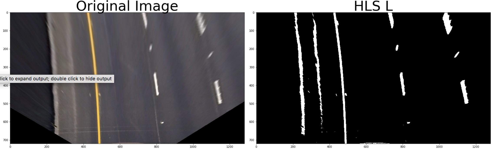 
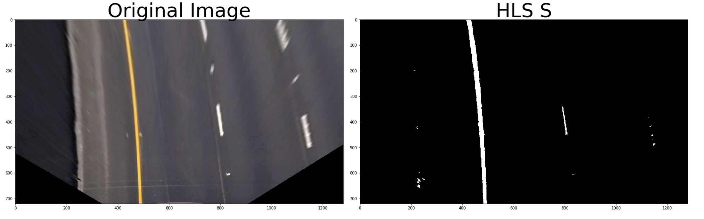


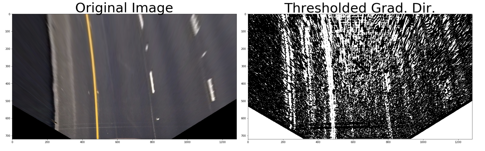
</dl>
#### 4. Performed a perspective transform and provide an example of a transformed image.

The code for my perspective transform includes a function called `warper()`, which appears in lines 1 through 8 in the file `example.py` (output_images/examples/example.py) (or, for example, in the 3rd code cell of the IPython notebook).  The `warper()` function takes as inputs an image (`img`), as well as source (`src`) and destination (`dst`) points.  I chose the hardcode the source and destination points in the following manner:

```python
src = np.float32(
    [[(img_size[0] / 2) - 55, img_size[1] / 2 + 100],
    [((img_size[0] / 6) - 10), img_size[1]],
    [(img_size[0] * 5 / 6) + 60, img_size[1]],
    [(img_size[0] / 2 + 55), img_size[1] / 2 + 100]])
dst = np.float32(
    [[(img_size[0] / 4), 0],
    [(img_size[0] / 4), img_size[1]],
    [(img_size[0] * 3 / 4), img_size[1]],
    [(img_size[0] * 3 / 4), 0]])
```

This resulted in the following source and destination points:

| Source        | Destination   | 
|:-------------:|:-------------:| 
| 585, 460      | 320, 0        | 
| 203, 720      | 320, 720      |
| 1127, 720     | 960, 720      |
| 695, 460      | 960, 0        |

I verified that my perspective transform was working as expected by drawing the `src` and `dst` points onto a test image and its warped counterpart to verify that the lines appear parallel in the warped image.

![alt text][image4]

#### 5. Describing the pipeline

After exprimenting all stuff i made a piple line in which i found that the HTS_L and HLS_S when combined give the best lane line result 

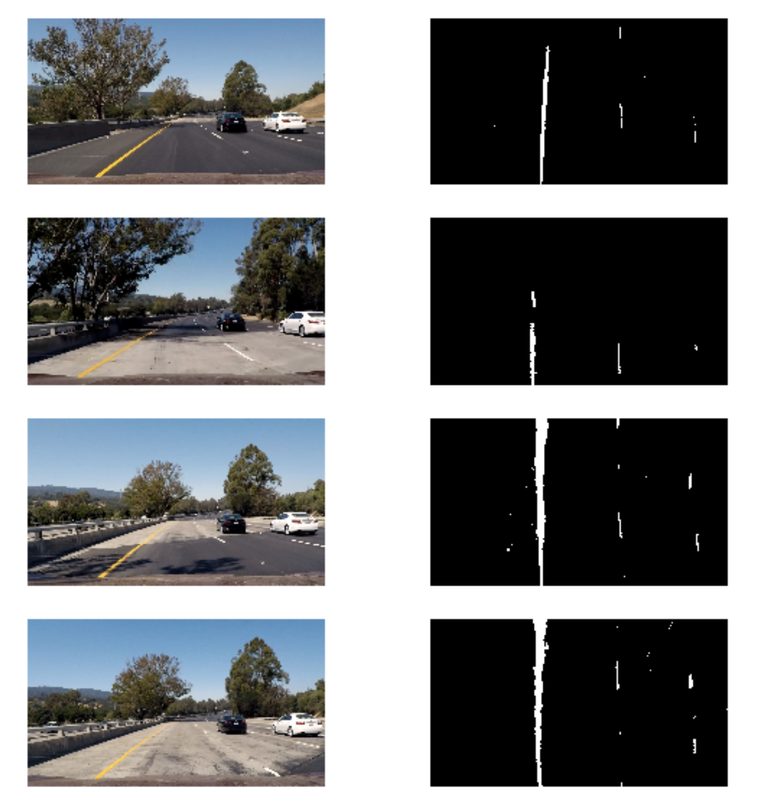
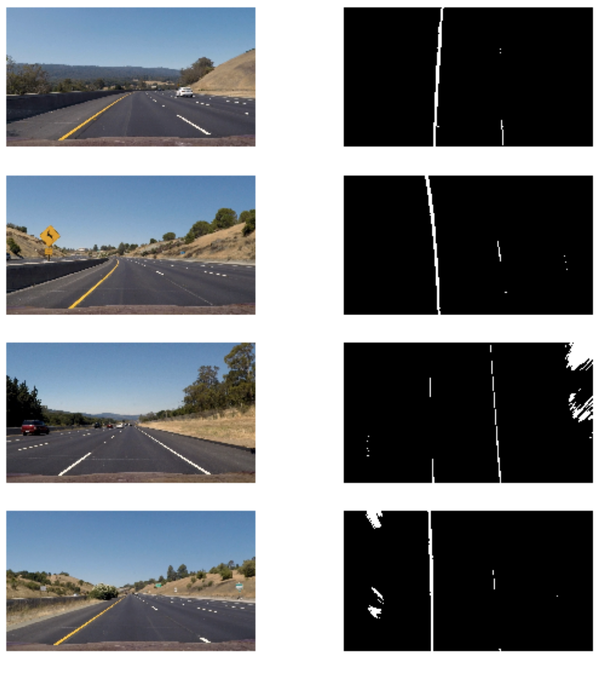


#### 6. Describe how (and identify where in your code) you identified lane-line pixels and fit their positions with a polynomial?

sliding window method was used twice but only one of them was used which was having detailed description 

one of them is just for learning purpose 

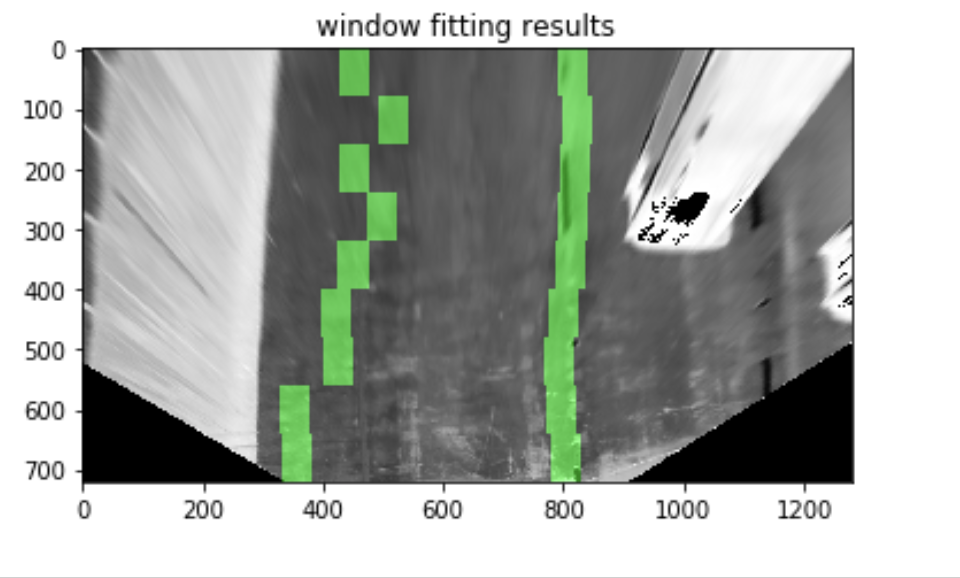

Another process in which I used  function sliding_window_polyfit() it included window masking and along with that 
i try to find the center of the lane line and one the lane line is detected i skipped the sliding window and fit the next frame into the video which can be check in polyfit_using_prev_fit() function

later the green shade was embeded in order get the video result with higligt track line


#### 7. Describe how (and identify where in your code) you calculated the radius of curvature of the lane and the position of the vehicle with respect to center.

usgin function calc_curv_rad_and_center_dist left radius , right radius and center is discovered the change in radius before that   draw_lane() function is used in order in which left fit and right fit used are used as the one of the main parameter to get extream left and right position and get the green higlit of the path

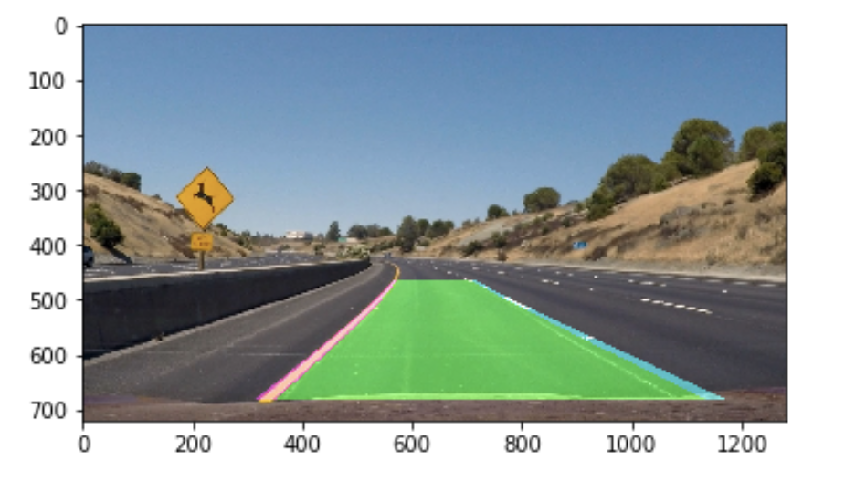


---

### Pipeline (video)

#### 1. Provide a link to your final video output.  Your pipeline should perform reasonably well on the entire project video (wobbly lines are ok but no catastrophic failures that would cause the car to drive off the road!).

Here's a [link to my video result](./project_video.mp4)


<video width="320" height="240" controls>
  <source src="./project_video.mp4" type="video/mp4">
Your browser does not support the video tag.
</video>
---


### Soution to problems I faced 

##### i faced lots of problems but i thing main thing to look at is the portion to unwrap  and pipeline 

##### The thing that worked for me was 
```python 
    combined[( ((hls_binary_s == 1)  & (hls_select_L==1) & (mag_thresh_val==1)| (LBThresh_img==1) ) )==1] = 1
    ```
    
and finally i was able to resubmit my code 